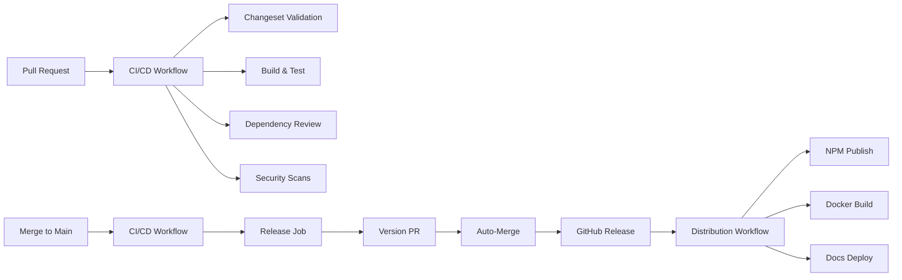

# GitHub Actions Workflows Documentation

This document describes the GitHub Actions workflows used in this repository and their purposes.

## Workflow Overview



## Core Workflows

### 1. CI/CD Workflow (`ci-cd.yml`)

**Purpose**: Main continuous integration and delivery pipeline

**Triggers**:

- Push to `main` branch
- Pull requests to `main` branch

**Key Features**:

- **Matrix Testing**: Tests against Node.js versions 20 and 22 in parallel
- **Security Scanning**: Runs CodeQL, OSV Scanner, and dependency review
- **Changeset Validation**: Ensures all PRs include changesets
- **Artifact Generation**: Creates build artifacts and SBOM
- **Attestations**: Generates SLSA provenance and SBOM attestations
- **Auto-Release**: Creates version PRs and GitHub releases

**Jobs**:

1. `build-test`: Builds, tests, and creates artifacts
2. `changeset-validation`: Validates changeset presence (PRs only)
3. `dependency-review`: Reviews dependencies for vulnerabilities (PRs only)
4. `osv-scan`: Scans for known vulnerabilities
5. `codeql`: Static security analysis
6. `release`: Creates version PRs and releases (main branch only)

**Required Secrets**: None (uses GITHUB_TOKEN)

**Required Variables**: None

### 2. Release Distribution (`release.yml`)

**Purpose**: Distributes releases to various platforms after GitHub release creation

**Triggers**:

- GitHub release published event

**Key Features**:

- **Multi-Platform Distribution**: NPM, Docker Hub, GitHub Container Registry, GitHub Pages
- **Conditional Execution**: Each distribution channel can be enabled/disabled
- **Multi-Architecture Docker**: Builds for both amd64 and arm64
- **Documentation Generation**: Auto-generates and deploys TypeDoc documentation
- **Release Artifacts**: Creates source and distribution tarballs with checksums

**Jobs**:

1. `prepare-release`: Downloads and prepares release assets
2. `npm-distribution`: Publishes to npm registry (if NPM_TOKEN configured)
3. `docker-distribution`: Builds and pushes Docker images (if ENABLE_DOCKER_RELEASE set)
4. `docs-distribution`: Deploys documentation to GitHub Pages (if ENABLE_DOCS_RELEASE set)
5. `release-artifacts`: Creates additional release artifacts
6. `notify-status`: Summarizes distribution status

**Required Secrets** (Optional):

- `NPM_TOKEN`: NPM authentication token for publishing
- `DOCKERHUB_USERNAME`: Docker Hub username
- `DOCKERHUB_TOKEN`: Docker Hub access token
- `SLACK_WEBHOOK`: Slack webhook URL for notifications

**Required Variables** (Optional):

- `ENABLE_DOCKER_RELEASE`: Set to 'true' to enable Docker distribution
- `ENABLE_DOCS_RELEASE`: Set to 'true' to enable documentation deployment

### 3. Auto-Merge Version PRs (`auto-merge-version-pr.yml`)

**Purpose**: Automatically enables auto-merge for changesets version PRs

**Triggers**:

- PR opened, reopened, synchronized, or ready for review
- Only runs for PRs titled "chore: version packages"

**Key Features**:

- **Security Validation**: Verifies PR is from github-actions bot
- **Auto-Merge Enable**: Attempts to enable auto-merge with squash strategy
- **Fallback Handling**: Gracefully handles missing PAT
- **User Instructions**: Comments with manual merge instructions

**Required Secrets** (Optional):

- `AUTO_MERGE_PAT`: Personal Access Token with `repo` scope for enabling auto-merge

### 4. Reusable Setup Workflow (`setup-node-pnpm.yml`)

**Purpose**: Reusable workflow for consistent Node.js and pnpm setup

**Usage**:

```yaml
jobs:
  my-job:
    uses: ./.github/workflows/setup-node-pnpm.yml
    with:
      node-version: '22'
      install-dependencies: true
      build: true
```

**Inputs**:

- `node-version`: Node.js version (default: '22')
- `pnpm-version`: pnpm version (default: '10.0.0')
- `install-dependencies`: Whether to install dependencies (default: true)
- `build`: Whether to build the project (default: false)

## Security Features

### Vulnerability Scanning

- **CodeQL**: Static analysis for security vulnerabilities
- **OSV Scanner**: Checks dependencies against OSV database
- **Dependency Review**: Reviews dependency changes in PRs
- **License Checking**: Blocks problematic licenses (GPL-3.0, AGPL-3.0)

### Supply Chain Security

- **SBOM Generation**: Creates CycloneDX SBOM for every release
- **SLSA Provenance**: Generates build provenance attestations
- **NPM Provenance**: Publishes packages with provenance when available
- **Container Attestations**: Creates attestations for Docker images

## Performance Optimizations

### Caching

- **pnpm Store**: Caches pnpm store directory
- **Node Modules**: Uses pnpm's efficient linking
- **Docker Layers**: GitHub Actions cache for Docker builds
- **Build Artifacts**: Reuses artifacts across jobs

### Parallelization

- **Matrix Builds**: Tests multiple Node versions simultaneously
- **Security Scans**: Runs security checks in parallel
- **Distribution Channels**: Processes distribution targets concurrently

## Troubleshooting

### Common Issues

#### 1. Auto-merge not working

**Problem**: Version PRs aren't automatically merging

**Solutions**:

- Verify `AUTO_MERGE_PAT` secret is configured
- Ensure PAT has `repo` scope
- Check branch protection allows auto-merge
- Verify required status checks are passing

#### 2. NPM publish failing

**Problem**: Package not publishing to npm

**Solutions**:

- Verify `NPM_TOKEN` secret is configured
- Check package.json isn't marked as private
- Ensure version doesn't already exist on npm
- Verify npm account has publish permissions

#### 3. Docker build failing

**Problem**: Docker images not building or pushing

**Solutions**:

- Set `ENABLE_DOCKER_RELEASE` variable to 'true'
- Verify `DOCKERHUB_TOKEN` and `DOCKERHUB_USERNAME` if using Docker Hub
- Check Dockerfile syntax and build context
- Ensure GitHub Packages permissions are configured

#### 4. Security scans blocking PR

**Problem**: Security checks preventing merge

**Solutions**:

- Review dependency-review comments in PR
- Update vulnerable dependencies
- Check license compliance
- Review CodeQL alerts in Security tab

### Debugging Workflows

1. **Enable debug logging**:

   ```bash
   gh workflow run <workflow-name> -f debug_enabled=true
   ```

2. **View workflow logs**:

   ```bash
   gh run list --workflow=<workflow-name>
   gh run view <run-id> --log
   ```

3. **Re-run failed jobs**:
   ```bash
   gh run rerun <run-id> --failed
   ```

## Best Practices

### For Contributors

1. Always include a changeset with your PR
2. Keep dependencies up to date
3. Run `pnpm verify` before pushing
4. Review security scan results in PR comments

### For Maintainers

1. Configure required secrets in repository settings
2. Enable required status checks in branch protection
3. Set up AUTO_MERGE_PAT for automated releases
4. Monitor workflow execution times and optimize as needed

## Workflow Secrets and Variables

### Repository Secrets

| Secret               | Required | Purpose                              |
| -------------------- | -------- | ------------------------------------ |
| `AUTO_MERGE_PAT`     | No       | Personal Access Token for auto-merge |
| `NPM_TOKEN`          | No       | NPM authentication for publishing    |
| `DOCKERHUB_USERNAME` | No       | Docker Hub username                  |
| `DOCKERHUB_TOKEN`    | No       | Docker Hub access token              |
| `SLACK_WEBHOOK`      | No       | Slack webhook for notifications      |

### Repository Variables

| Variable                | Required | Purpose                    | Default |
| ----------------------- | -------- | -------------------------- | ------- |
| `ENABLE_DOCKER_RELEASE` | No       | Enable Docker distribution | false   |
| `ENABLE_DOCS_RELEASE`   | No       | Enable docs deployment     | false   |

## Monitoring and Metrics

### Workflow Performance

- Average CI time: ~2-3 minutes
- Release distribution: ~5-7 minutes
- Security scans: ~1-2 minutes

### Success Metrics

- CI pass rate
- Release success rate
- Security scan findings
- Dependency update frequency

## Future Improvements

- [ ] Add performance benchmarking
- [ ] Implement cost tracking for Actions minutes
- [ ] Add Renovate/Dependabot configuration
- [ ] Create dashboard for workflow metrics
- [ ] Add nightly regression testing
- [ ] Implement canary releases
