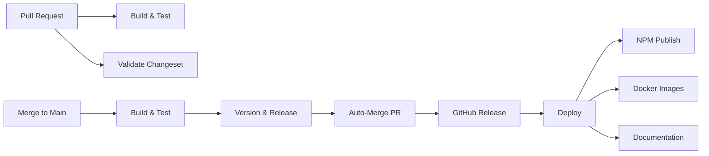

# GitHub Actions Workflows Documentation

This document describes the GitHub Actions workflows used in this repository.

## Workflow Overview

## Workflows

### 1. Continuous Deployment (`continuous-deployment.yml`)

**Purpose**: Main CI/CD pipeline that handles building, testing, versioning, and deployment.

**Triggers**:

- Push to `main` branch
- Pull requests to `main` branch

**Jobs**:

1. **Build and Test**: Runs on every push and PR
   - Installs dependencies
   - Runs audit, typecheck, lint, format, and tests
   - Builds artifacts and generates SBOM (main branch only)
   - Uploads artifacts with simplified naming

2. **Validate Changeset**: PR only
   - Ensures every PR includes a changeset

3. **Version and Release**: Main branch only
   - Creates version PRs using changesets
   - Auto-creates GitHub releases when versions change
   - Uses PAT if configured for workflow triggering

4. **Deploy**: After release creation
   - Deploys to npm (always)
   - Deploys to Docker (if `ENABLE_DOCKER_RELEASE=true`)
   - Deploys to docs (if `ENABLE_DOCS_RELEASE=true`)

**Required Secrets**:

- `CHANGESETS_PAT`: Personal Access Token for creating PRs that trigger workflows (optional but recommended)
- `NPM_TOKEN`: For npm publishing (optional)
- `DOCKERHUB_USERNAME` & `DOCKERHUB_TOKEN`: For Docker Hub (optional)

### 2. Auto-Merge Version PRs (`auto-merge-version-pr.yml`)

**Purpose**: Automatically enables auto-merge for changesets version PRs.

**Triggers**:

- PR opened, reopened, synchronized, or ready for review
- Only runs for PRs titled "chore: version packages"

**Features**:

- Verifies PR is from github-actions bot
- Attempts to enable auto-merge with squash strategy
- Falls back gracefully if PAT not configured
- Adds informative comment to PR

**Required Secrets**:

- `AUTO_MERGE_PAT`: Personal Access Token with `repo` scope (optional)

### 3. Reusable Deploy (`reusable-deploy.yml`)

**Purpose**: Handles deployment to different targets (npm, Docker, docs).

**Called by**: `continuous-deployment.yml`

**Deployment Targets**:

- **NPM**: Publishes packages with provenance
- **Docker**: Multi-architecture images to GHCR and Docker Hub
- **Documentation**: GitHub Pages deployment

## Configuration

### Required Secrets

| Secret               | Purpose                           | Required For    |
| -------------------- | --------------------------------- | --------------- |
| `CHANGESETS_PAT`     | Create PRs that trigger workflows | Auto-versioning |
| `AUTO_MERGE_PAT`     | Enable auto-merge on version PRs  | Auto-merge      |
| `NPM_TOKEN`          | NPM authentication                | NPM publishing  |
| `DOCKERHUB_USERNAME` | Docker Hub username               | Docker Hub push |
| `DOCKERHUB_TOKEN`    | Docker Hub access token           | Docker Hub push |

### Repository Variables

| Variable                | Purpose                    | Default |
| ----------------------- | -------------------------- | ------- |
| `ENABLE_DOCKER_RELEASE` | Enable Docker distribution | `false` |
| `ENABLE_DOCS_RELEASE`   | Enable docs deployment     | `false` |

## Setup Instructions

### 1. Create a Personal Access Token (PAT)

For full automation, create a fine-grained PAT with:

- **Repository access**: Your repository
- **Permissions**: Actions (Read), Contents (Write), Pull requests (Write), Workflows (Write)

Add as `CHANGESETS_PAT` and/or `AUTO_MERGE_PAT` secrets.

### 2. Configure NPM Publishing

1. Get NPM token from npmjs.com
2. Add as `NPM_TOKEN` secret

### 3. Enable Docker Distribution (Optional)

1. Set `ENABLE_DOCKER_RELEASE=true` variable
2. Add Docker Hub credentials if using Docker Hub

### 4. Enable Documentation (Optional)

1. Enable GitHub Pages in repository settings
2. Set `ENABLE_DOCS_RELEASE=true` variable

## How It Works

1. **Developer creates PR** with changes and changeset
2. **CI validates** the PR (tests pass, changeset present)
3. **PR is merged** to main branch
4. **Build runs** and creates artifacts
5. **Changesets creates version PR** (using PAT if configured)
6. **Auto-merge enables** on version PR
7. **Version PR auto-merges** when checks pass
8. **Release is created** with changelog
9. **Deployment runs** to configured channels

## Troubleshooting

### Version PRs Not Auto-Merging

- Verify `AUTO_MERGE_PAT` or `CHANGESETS_PAT` is configured
- Check that auto-merge is enabled in repository settings
- Ensure required status checks are passing

### NPM Publish Failing

- Verify `NPM_TOKEN` is valid
- Check package.json version doesn't already exist
- Ensure package isn't marked as private (workflow handles this)

### Artifacts Not Found

- Check that build job completed successfully
- Artifacts are retained for 30 days
- Artifact names are simplified: `build` and `sbom`

## Best Practices

1. **Always include changesets** in PRs
2. **Configure PAT** for full automation
3. **Keep secrets secure** and rotate regularly
4. **Monitor workflow runs** for failures
5. **Use `pnpm verify`** before pushing code
