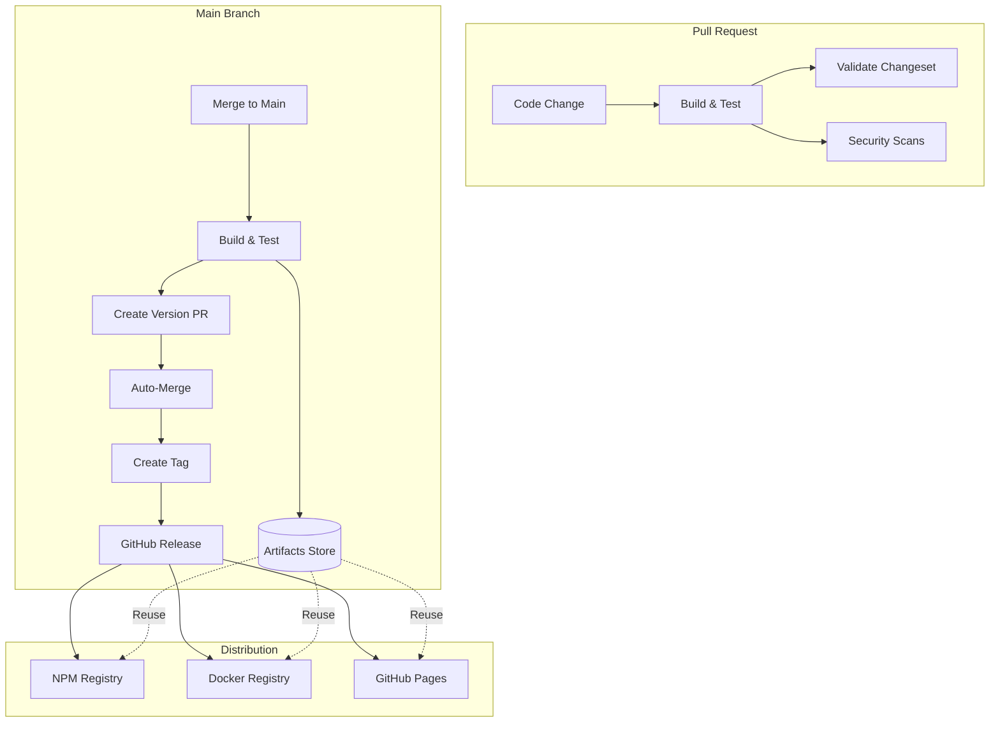

# Continuous Deployment Architecture

## Overview

This repository implements a **Build Once, Deploy Many** continuous deployment architecture that ensures artifacts are built once during CI and reused across all deployment targets, improving efficiency and consistency.

## Core Principles

1. **Build Once**: All artifacts are built and tested once in the CI pipeline
2. **Artifact Reuse**: The same artifacts are deployed to all environments
3. **Automated Flow**: Code flows automatically from merge → version → release → deploy
4. **No Manual Steps**: With proper configuration, the entire pipeline is hands-free

## Architecture Diagram



## Workflow Components

### 1. Reusable Build Workflow (`reusable-build.yml`)

**Purpose**: Centralized build and test logic that produces versioned artifacts

**Key Features**:

- Runs all tests, linting, and type checking
- Generates SBOM (Software Bill of Materials)
- Creates attestations for supply chain security
- Uploads artifacts with unique IDs for traceability
- Outputs artifact IDs for downstream consumption

**Artifacts Produced**:

- `build-{run-id}-{attempt}`: Contains dist/, package.json, pnpm-lock.yaml
- `sbom-{run-id}-{attempt}`: Contains SBOM in CycloneDX format
- `manifest-{run-id}-{attempt}`: Contains build metadata

### 2. Reusable Deploy Workflow (`reusable-deploy.yml`)

**Purpose**: Deploy pre-built artifacts to various targets without rebuilding

**Deployment Targets**:

- **NPM**: Publishes packages with provenance
- **Docker**: Multi-architecture images (amd64/arm64)
- **Documentation**: GitHub Pages deployment

**Key Features**:

- Downloads and reuses CI artifacts
- Conditional deployment based on secrets/variables
- Attestation generation for containers
- No rebuilding - uses artifacts as-is

### 3. Continuous Deployment Orchestrator (`continuous-deployment.yml`)

**Purpose**: Main workflow that orchestrates the entire CD pipeline

**Phases**:

1. **Build Phase**: Calls reusable build workflow
2. **Security Phase**: Runs security scans in parallel
3. **Validation Phase**: Ensures PRs have changesets
4. **Version Phase**: Creates version PRs and releases
5. **Deploy Phase**: Distributes to all configured targets

**Key Features**:

- PAT support for version PRs that trigger workflows
- Parallel deployment to multiple targets
- Automatic release creation with changelog

### 4. Release Distribution (`release-distribution.yml`)

**Purpose**: Alternative entry point for distributing existing releases

**Use Cases**:

- Manual re-deployment of releases
- Recovery from failed deployments
- Testing deployment configurations

## Configuration

### Required Secrets

| Secret               | Purpose                                                       | Required For       |
| -------------------- | ------------------------------------------------------------- | ------------------ |
| `CHANGESETS_PAT`     | Personal Access Token for creating PRs that trigger workflows | Auto-merge to work |
| `NPM_TOKEN`          | NPM authentication token                                      | NPM publishing     |
| `DOCKERHUB_USERNAME` | Docker Hub username                                           | Docker Hub push    |
| `DOCKERHUB_TOKEN`    | Docker Hub access token                                       | Docker Hub push    |
| `SLACK_WEBHOOK`      | Slack webhook URL                                             | Notifications      |

### Required Variables

| Variable                | Purpose                         | Default |
| ----------------------- | ------------------------------- | ------- |
| `ENABLE_DOCKER_RELEASE` | Enable Docker distribution      | `false` |
| `ENABLE_DOCS_RELEASE`   | Enable documentation deployment | `false` |

### Repository Settings

1. **Enable Auto-Merge**:
   - Settings → General → Pull Requests
   - ✅ Allow auto-merge
   - ✅ Allow squash merging

2. **Configure Branch Protection** (optional but recommended):
   ```yaml
   main:
     required_status_checks:
       - 'Build / Build and Test'
       - 'Security / Security'
     allow_auto_merge: true
   ```

## Setup Instructions

### 1. Create a Fine-Grained Personal Access Token

1. Go to GitHub Settings → Developer settings → Personal access tokens → Fine-grained tokens
2. Click "Generate new token"
3. Configure:
   - **Name**: `CHANGESETS_PAT`
   - **Expiration**: 90 days (or your preference)
   - **Repository access**: Select your repository
   - **Permissions**:
     - Actions: Read
     - Contents: Write
     - Metadata: Read
     - Pull requests: Write
     - Workflows: Write

4. Copy the token and add it as a repository secret named `CHANGESETS_PAT`

### 2. Configure Distribution Channels

#### NPM Publishing

1. Get NPM token from npmjs.com
2. Add as repository secret: `NPM_TOKEN`

#### Docker Distribution

1. Create Docker Hub access token
2. Add secrets:
   - `DOCKERHUB_USERNAME`
   - `DOCKERHUB_TOKEN`
3. Set variable: `ENABLE_DOCKER_RELEASE=true`

#### Documentation

1. Enable GitHub Pages in repository settings
2. Set variable: `ENABLE_DOCS_RELEASE=true`

## How It Works

### Automated Release Flow

1. **Developer creates PR** with changes and changeset
2. **CI runs** build, test, and validation
3. **PR is merged** to main branch
4. **CI builds artifacts** and stores them (90-day retention)
5. **Changesets creates version PR** using PAT
6. **Version PR triggers CI** (because PAT was used)
7. **Auto-merge enables** on version PR
8. **When checks pass**, PR auto-merges
9. **Version merge triggers**:
   - Tag creation
   - GitHub release with changelog
   - Artifact metadata in release
10. **Release triggers distribution**:
    - Downloads CI artifacts (no rebuild)
    - Deploys to configured channels
    - Creates additional release artifacts

### Manual Intervention Points

While the system is designed to be fully automated, manual intervention is possible at:

1. **Version PR Review**: Can be manually reviewed before auto-merge
2. **Auto-merge disable**: Can disable auto-merge for manual control
3. **Release distribution**: Can manually trigger via workflow_dispatch

## Troubleshooting

### Version PRs Not Triggering CI

**Problem**: PRs created by changesets don't trigger workflows

**Solution**: Ensure `CHANGESETS_PAT` is configured with workflow write permission

### Auto-merge Not Working

**Problem**: Version PRs don't auto-merge

**Solutions**:

1. Check that auto-merge is enabled in repository settings
2. Verify `CHANGESETS_PAT` or `AUTO_MERGE_PAT` is configured
3. Ensure all required status checks are passing

### Artifacts Not Found During Deploy

**Problem**: Deploy job can't find build artifacts

**Solutions**:

1. Check artifact retention (default 90 days)
2. Verify artifact IDs match between build and deploy
3. Ensure build job completed successfully

### NPM Publish Fails

**Problem**: Package already exists or auth fails

**Solutions**:

1. Verify `NPM_TOKEN` is valid
2. Check package version doesn't already exist
3. Ensure package.json isn't marked private (or workflow handles it)

## Best Practices

1. **Always use changesets** for version management
2. **Configure PAT** for full automation
3. **Set up branch protection** for quality gates
4. **Monitor artifact storage** to manage costs
5. **Use matrix strategy** for parallel deployments
6. **Enable only needed** distribution channels

## Cost Optimization

- **Artifact retention**: Set to 90 days by default, adjust based on needs
- **Parallel jobs**: Use matrix strategy to reduce total time
- **Conditional deployment**: Only deploy to configured channels
- **Reuse artifacts**: Never rebuild the same code twice

## Security Considerations

- **PAT rotation**: Rotate PATs every 90 days
- **Least privilege**: Use fine-grained PATs with minimal permissions
- **Attestations**: All builds include SLSA provenance and SBOM
- **Secret scanning**: Enable GitHub secret scanning
- **Dependency review**: Automated on all PRs
